# 프로젝트
https://jeniy01.github.io/web1

## 프로젝트 개요
통합개발환경 : eclipse luna
개발 언어 : java1.8 jsp3.1
dbms : postgresql

## 프로젝트 설계 - 물리적 설계
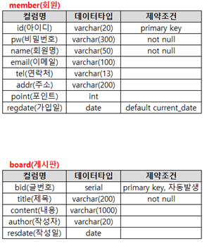

## 프로젝트 설계 - 회원(member)테이블 구현
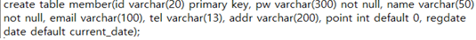 

## 프로젝트 설계 - 게시판(board)테이블 구현
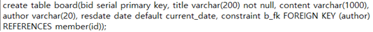 

## 프로젝트 설계 - 테이블ERD
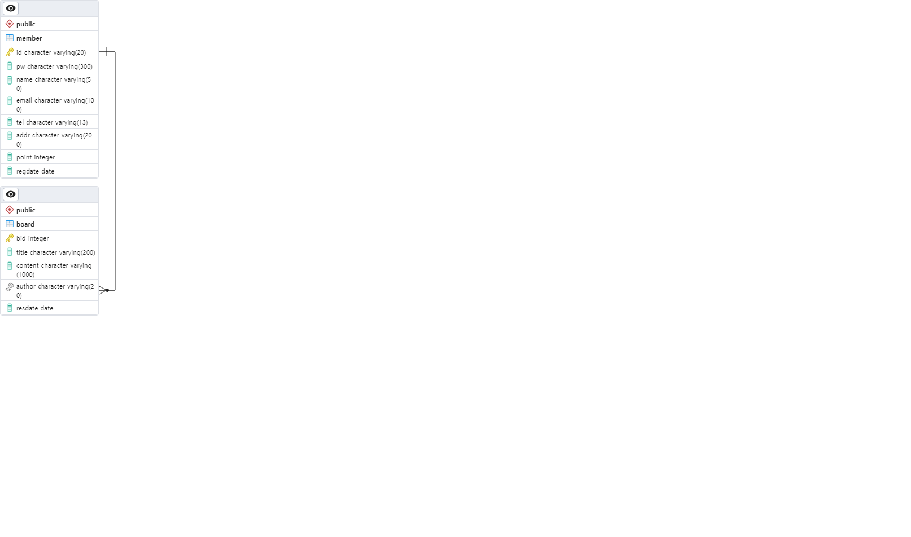 

## 프로젝트 설계 - 기능구현 설명
-회원 기능
1. 회원가입
약관페이지(agreement.jsp) -> 회원가입폼(join.jsp) -> 아이디 중복확인(idCheck.jsp) -> 회원가입 처리(joinpro.jsp) -> 메인페이지(index.jsp)
2. 로그인
로그인폼(login.jsp) -> 로그인 처리(loginpro.jsp) -> 메인페이지(index.jsp)
3. 로그아웃
메인페이지(index.jsp) -> 로그아웃 처리(logout.jsp) -> 메인페이지(index.jsp)
4. 회원 정보 수정
로그인 후 마이페이지(mypage.jsp) -> 정보수정페이지(member_mod.jsp) -> 회원정보 수정처리(member_modify_pro.jsp) -> 마이페이지(mypage.jsp)
5. 회원 탈퇴
로그인 후 마이페이지(mypage.jsp) -> 회원 탈퇴 처리(member_del.jsp) -> 메인화면(index.jsp)

-게시판 기능
1. 게시글 등록
로그인 후 공지사항 페이지(sub4.jsp#page4) -> 글쓰기 페이지(boardInsert.jsp) -> 글 등록 처리(boardInsertPro.jsp) -> 공지사항 페이지(sub4.jsp#page4)
2. 게시글 수정
관리자로 로그인 후 공지사항 페이지(sub4.jsp#page4) -> 게시글 상세 보기 페이지(boardDetail.jsp) -> 글 수정 페이지(boardUpdate.jsp) -> 글 수정 처리(boardUpdatePro.jsp) -> 공지사항 페이지(sub4.jsp#page4) -> 게시글 상세 보기(boardDetail.jsp)
3. 게시글 삭제
관리자로 로그인 후 공지사항 페이지(sub4.jsp#page4) -> 게시글 상세 보기 페이지(boardDetail.jsp) -> 삭제 처리(boardDel.jsp) -> 공지사항 페이지(sub4.jsp#page4)

-관리자 기능
1. 관리자의 회원 목록 및 회원 정보 상세 페이지 생성과 테스트
관리자로 로그인 후 관리자 클릭하여 관리자 페이지(index.jsp) -> 회원관리 누르거나 회원등록현황에서 더보기 눌러서 회원 관리 페이지(member_manage.jsp)
2. 직권 등록
관리자로 로그인 후 관리자 클릭하여 관리자 페이지(index.jsp) -> 회원관리 누르거나 회원등록현황에서 더보기 눌러서 회원 관리 페이지(member_manage.jsp) -> 회원 직권 등록 눌러서 회원 등록 페이지(memberInsert.jsp) -> 아이디 중복확인(idCheck.jsp) -> 회원가입 처리(joinpro.jsp) -> 회원 관리 페이지(member_manage.jsp) -> 회원 정보 상세보기 페이지(memberDetail.jsp)
3. 직권 탈퇴
관리자로 로그인 후 관리자 클릭하여 관리자 페이지(index.jsp) -> 회원관리 누르거나 회원등록현황에서 더보기 눌러서 회원 관리 페이지(member_manage.jsp) -> 직권탈퇴 처리(member_del.jsp) -> 회원 관리 페이지(member_manage.jsp)
4. 관리자의 게시판 관리 페이지 생성과 테스트
관리자로 로그인 후 관리자 클릭하여 관리자 페이지(index.jsp) -> 게시판 관리 누르거나 게시판 현황에서 더보기 눌러서 게시판 관리 페이지(board_manage.jsp)
5. 게시글 작성
관리자로 로그인 후 관리자 클릭하여 관리자 페이지(index.jsp) -> 게시판 관리 누르거나 게시판 현황에서 더보기 눌러서 게시판 관리 페이지(board_manage.jsp) -> 글 등록 눌러서 글 등록 페이지(boardInsert.jsp) -> 글 등록 처리(boardInsertPro.jsp) -> 게시판 관리 페이지(board_manage.jsp)
6. 게시글 수정
관리자로 로그인 후 관리자 클릭하여 관리자 페이지(index.jsp) -> 게시판 관리 누르거나 게시판 현황에서 더보기 눌러서 게시판 관리 페이지(board_manage.jsp) -> 글 눌러서 글 상세 보기 페이지(boardDetail.jsp) -> 글 수정 페이지(boardUpdate.jsp) -> 글 수정 처리(boardUpdatePro.jsp) -> 게시판 관리 페이지(board_manage.jsp)
7. 게시글 삭제
관리자로 로그인 후 관리자 클릭하여 관리자 페이지(index.jsp) -> 게시판 관리 누르거나 게시판 현황에서 더보기 눌러서 게시판 관리 페이지(board_manage.jsp) -> 글 삭제 처리(board_del.jsp) -> 게시판 관리 페이지(board_manage.jsp)

## 프로젝트 설계 - 기능구현
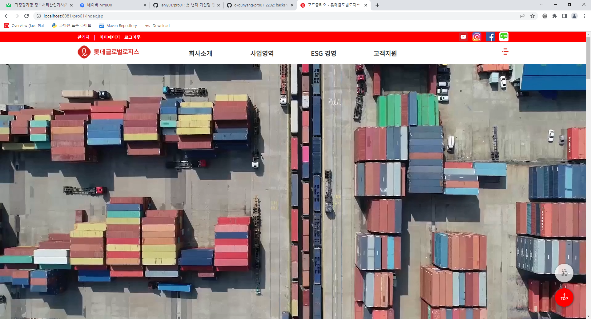
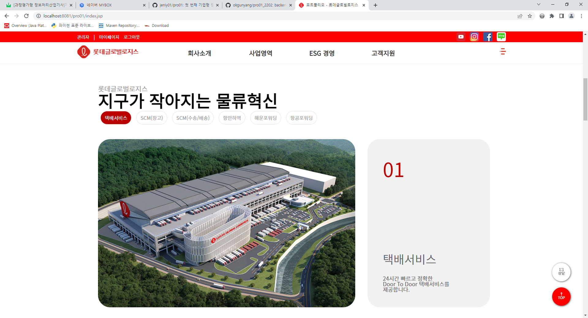
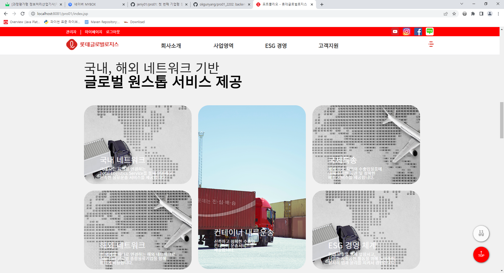
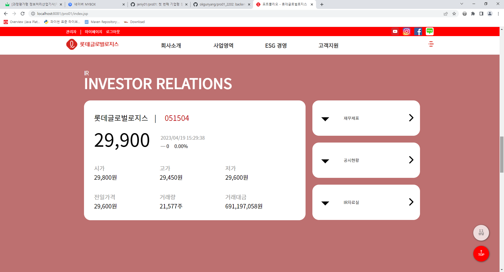
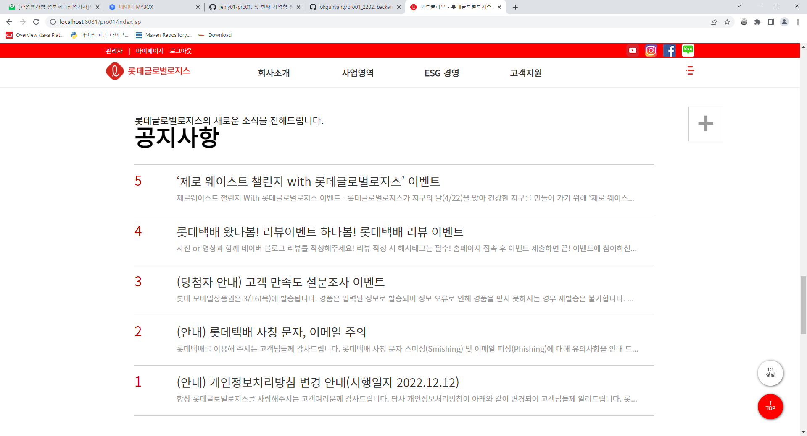
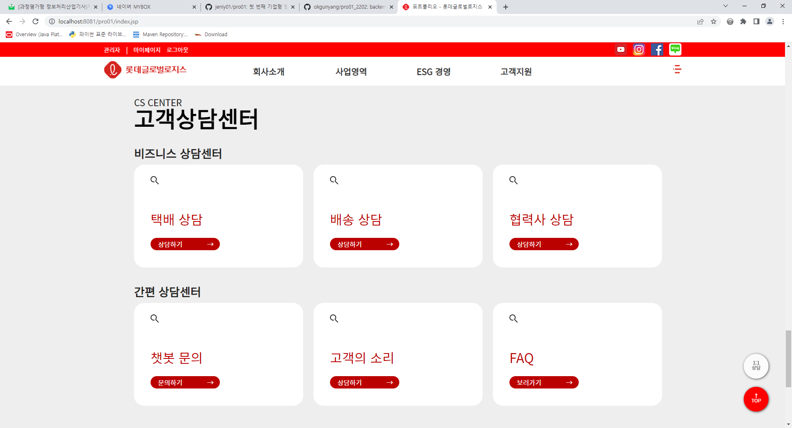
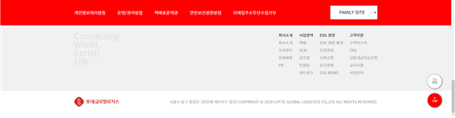
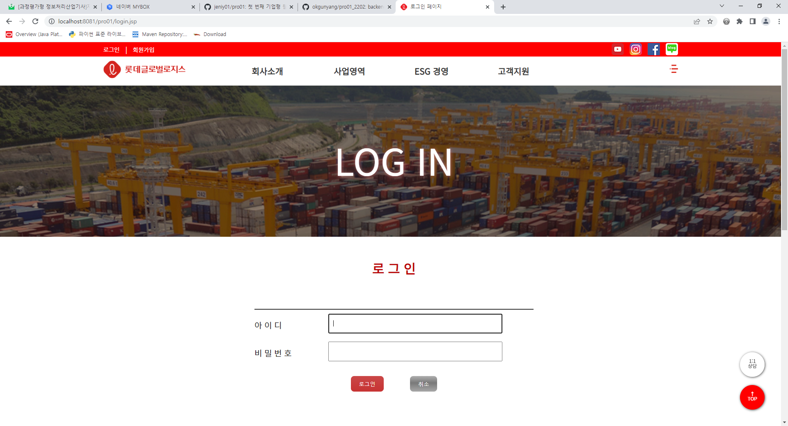
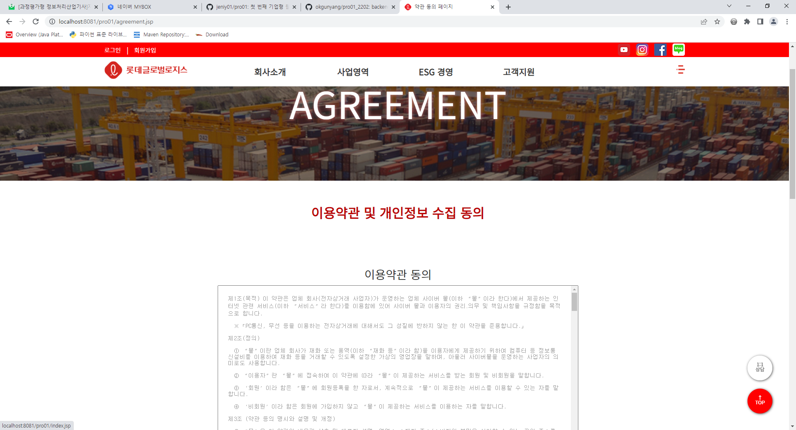
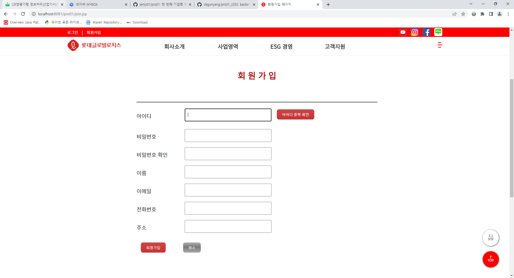
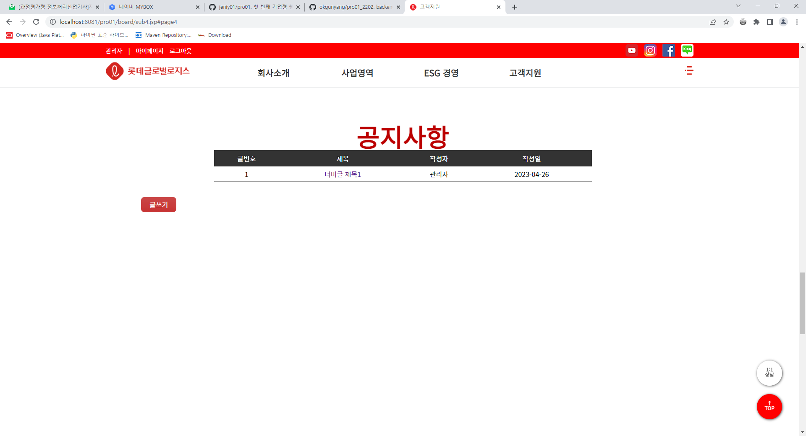
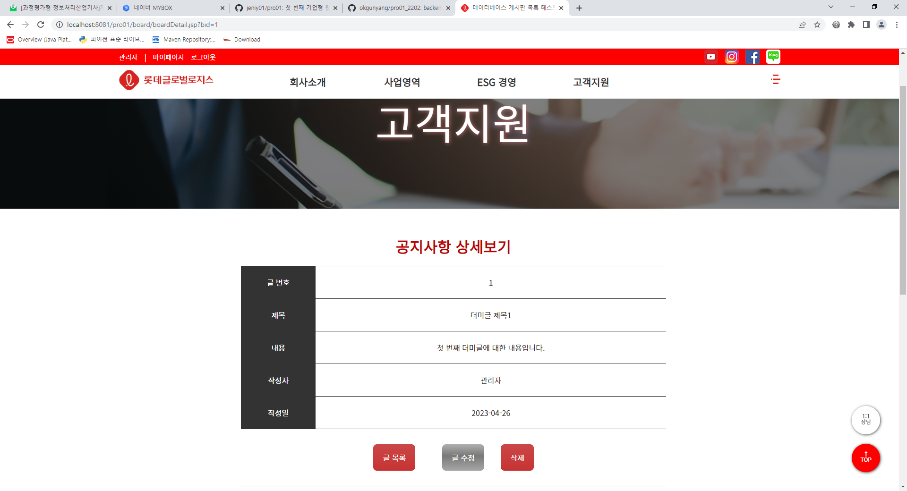

<!--

  

## 기능 구현

>

